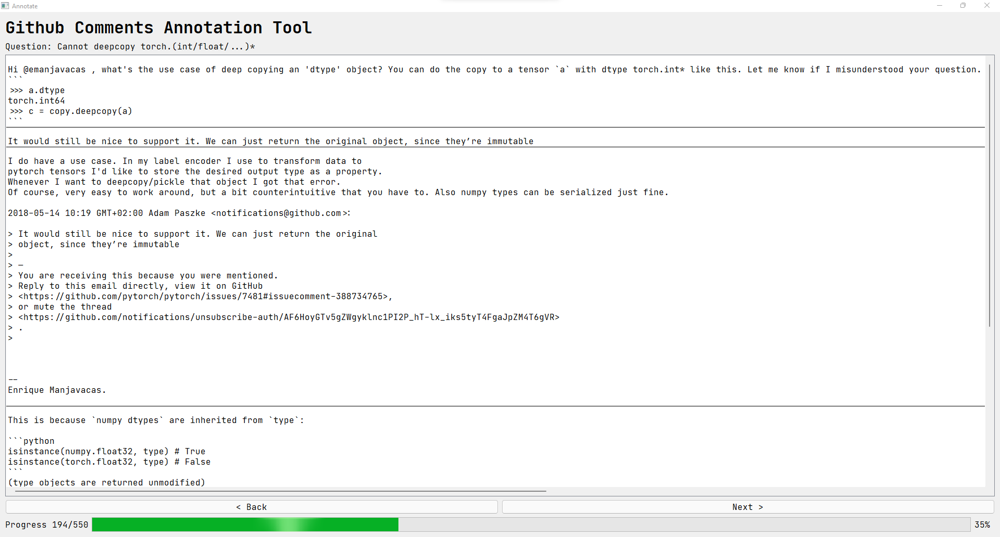

# GitHub Issues Annotation

I created an annotation tool to choose the correct comment (solution) for each issue.



Install the dependencies

```shell
pip install requirements.txt
```

create a file `API_KEYS.py` with the following content:

```python
GITHUB_TOKEN = "<YOUR_GITHUB_KEY>"
```

Modify the issue range to the array indices of `queries_and_comment_by_reaction_score_updated.json`, if you do not use that format, then you will have to update the code to make it work.

Now run the annotator

```python
    annot_model = AnnotationsModel(start_idx=194, issues_range=(3301 - 1, 3850 - 1 + 1))
```

USAGE:

```shell
python annotate.py
```

Every time to click next, or hit right-arrow the annotations are saved.
